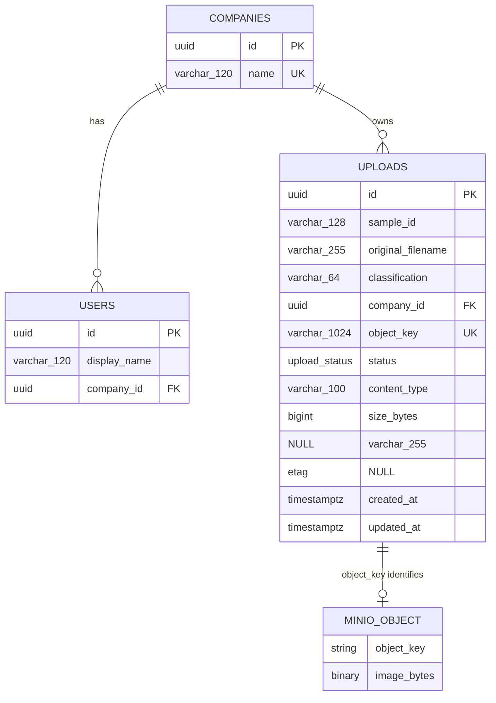

# Secure Research Image Upload

A small local full-stack application that demonstrates company-isolated research-image uploads with a private MinIO bucket and PostgreSQL metadata.

Repository: [github.com/NoamHadad12/secure-research-image-upload](https://github.com/NoamHadad12/secure-research-image-upload)

The application is intentionally narrow: Hospital A can upload, list, inspect, and download its own files, while Hospital B receives the same generic not-found response for Hospital A records as it receives for nonexistent records. Authorization is enforced by the FastAPI backend before any storage URL is signed.

## Technology and security summary

- React 19, TypeScript, and Vite frontend
- Python 3.12 and FastAPI backend
- PostgreSQL 17 for structured metadata
- Private MinIO object storage for image bytes
- SQLAlchemy 2 and Alembic for persistence and migrations
- Short-lived presigned URLs: 5 minutes for upload and 1 minute for download
- Development identities for Alice at Hospital A and Bob at Hospital B

The browser never receives MinIO credentials, never supplies a company ID, and never chooses an object key. The backend resolves the company from the development user identity and generates keys in this form:

```text
uploads/{company-id}/{upload-id}/{safe-filename}
```

## 1. Setup and run instructions

### Prerequisites

- Docker Desktop with Docker Compose v2
- Git, if cloning the repository
- Ports `5173`, `8000`, `9000`, `9001`, and `5432` available locally

Clone and enter the repository:

```bash
git clone https://github.com/NoamHadad12/secure-research-image-upload.git
cd secure-research-image-upload
```

The Compose file contains safe local-development defaults, so an `.env` file is optional. To make the configuration explicit, copy the example first:

```powershell
Copy-Item .env.example .env
```

On macOS or Linux, use:

```bash
cp .env.example .env
```

Do not reuse these placeholder credentials outside local development and do not commit `.env`.

Validate the resolved configuration and start the stack:

```bash
docker compose config
docker compose up --build -d
docker compose ps
```

Open [http://localhost:5173](http://localhost:5173). Select Alice or Bob with the development user switch. The API health endpoint is [http://localhost:8000/health](http://localhost:8000/health), and local API documentation is available at [http://localhost:8000/docs](http://localhost:8000/docs).

To inspect logs:

```bash
docker compose logs -f backend frontend minio postgres
```

To stop the containers without deleting their volumes:

```bash
docker compose down
```

## 2. How to start MinIO and the database service

`docker compose up --build -d` starts all required services:

| Service | Local address | Purpose |
| --- | --- | --- |
| `frontend` | `http://localhost:5173` | React user interface |
| `backend` | `http://localhost:8000` | FastAPI application and authorization boundary |
| `minio` | `http://localhost:9000` | S3-compatible object API |
| `minio` console | `http://localhost:9001` | Local storage administration only |
| `postgres` | `localhost:5432` | Structured application metadata |

The backend runs `alembic upgrade head` before starting, seeds the two development users and companies, creates the configured MinIO bucket if needed, and removes any public bucket policy. PostgreSQL and MinIO data are kept in named Docker volumes.

Useful service checks:

```bash
docker compose ps
docker compose exec backend python -c "from app.main import app; print(app.title)"
```

The MinIO root credentials in `.env.example` are local placeholders used only by the MinIO and backend containers. They are never compiled into or returned to the frontend. A production deployment should replace backend root access with a least-privilege service account and load secrets from a secrets manager.

## 3. How to run tests and checks

With the stack running, execute:

```bash
docker compose exec backend pytest
docker compose exec backend ruff check .
docker compose exec frontend npm run build
```

The backend suite currently contains 57 tests. It includes the four required cases:

1. Hospital A can create and access its own upload record.
2. Hospital B is denied access to Hospital A's upload record.
3. Hospital B cannot obtain a download URL for Hospital A's object.
4. Missing or invalid upload metadata is rejected.

It also covers generic foreign/nonexistent responses, object-key generation, confirmation checks, status processing, presigned URL expiry, private storage configuration, and public response-field restrictions.

For a complete local validation pass:

```bash
docker compose config
docker compose up --build -d
docker compose exec backend pytest
docker compose exec backend ruff check .
docker compose exec frontend npm run build
docker compose ps
```

## 4. Data model

Only metadata is stored in PostgreSQL. The diagram includes the MinIO object to make the storage boundary visible; `MINIO_OBJECT` is not a database table.



The `upload_status` PostgreSQL enum contains:

```text
pending_upload, uploaded, queued, processing, completed, failed
```

`pending_upload` is an internal pre-confirmation state. The other five values are the assignment's required processing states. The public upload records contain the upload ID, sample ID, original filename, classification, status, and creation time; they intentionally omit the company ID, object key, ETag, and stored size.

## 5. Why metadata and object bytes are stored separately

PostgreSQL is the right store for relationships, tenant-scoped queries, constraints, timestamps, and status transitions. MinIO is designed for large binary byte streams, S3-compatible transfer, and object lifecycle controls. Separating them keeps list and authorization queries small, avoids moving image bytes through the database or API server, and allows each system to scale and be backed up according to its workload.

The database stores only the generated object key and verified object facts such as size and ETag. That reference is security-sensitive: the backend reads it only from a company-scoped database record before calling MinIO. A database row alone does not make a bucket public, and knowing an object key does not grant access to the private bucket.

## 6. Upload flow and presigned URL lifecycle

1. The user selects Alice or Bob, enters a sample ID and classification, and chooses a PNG, JPEG, or WebP image of at most 10 MiB.
2. The browser sends only `sample_id`, `filename`, `classification`, and `content_type` to `POST /api/uploads/initiate`, together with the development `X-User-ID` header.
3. The backend resolves the user and company, validates the metadata, allocates an upload UUID, sanitizes the filename, and generates the company-scoped object key. Client-supplied `company_id`, `object_key`, or other extra fields are rejected.
4. The backend creates a `pending_upload` row and returns a presigned MinIO `PUT` URL valid for 5 minutes.
5. The browser sends the file bytes directly to MinIO with that URL. MinIO credentials never pass through the browser.
6. The browser calls `POST /api/uploads/{upload_id}/confirm`; it sends the upload ID, not an object key.
7. The backend performs a company-scoped row lookup, reads the object key from that authorized row, and asks MinIO to verify that the object exists. It rejects missing, empty, or larger-than-10-MiB objects without marking the upload complete.
8. After verification, the backend stores size and ETag, changes the state to `uploaded`, and schedules the local processing simulation. The simulation advances through `queued`, `processing`, and `completed`, or records `failed` if processing raises an exception.

The URL is a time-limited bearer capability, not a one-time token. It can be reused for the same signed operation and object until it expires, so it should not be logged, persisted unnecessarily, or shared. An initiated upload that is never confirmed remains `pending_upload`; production cleanup is discussed below.

## 7. Download flow and server-side authorization

1. The UI asks the backend for `POST /api/uploads/{upload_id}/download-url`.
2. The backend resolves the current user and queries by both `upload_id` and `company_id`.
3. A foreign upload ID and a nonexistent upload ID both return exactly `404 Upload not found`. The backend does not reveal filename, status, company, object key, or whether the foreign object exists.
4. Only after authorization succeeds does the backend read the object key from the row and create a presigned MinIO `GET` URL valid for 1 minute.
5. The browser downloads the bytes directly from MinIO.

List and detail routes use the same company scope. Hospital B therefore cannot list, inspect, confirm, or request a download URL for a Hospital A upload, even if Bob knows the upload UUID or object key. An unsigned request to the MinIO bucket remains forbidden.

## 8. Why presigned URLs are safer than exposing MinIO credentials

A presigned URL delegates one storage operation against one generated object key for a short period. The browser receives no access key or secret key and cannot use the URL to list the bucket, access another key, or mint more URLs. If a URL is exposed, its useful lifetime and scope are much smaller than those of long-lived credentials.

This design also keeps large file bytes off the application server while preserving a backend-controlled authorization decision before each upload or download capability is issued.

## 9. Why presigned URLs do not replace application authorization

MinIO validates the URL signature, operation, key, and expiry; it does not understand Hospital A, Hospital B, users, samples, or application policy. If the backend signed a URL before checking tenant ownership, MinIO would honor that valid signature even for the wrong user.

For that reason, every protected lookup is scoped by both the upload ID and the company derived on the server. Authorization occurs before signing, and the object key comes from the authorized database row rather than from the request. Presigned URLs must still be treated as bearer secrets until they expire.

The current `X-User-ID` switch is an assignment-approved development substitute for login, not production authentication. Anyone who can forge a seeded ID could impersonate that user. Production must authenticate a real session or token, map it to an immutable server-side tenant identity, and retain the same backend authorization rules.

## 10. URL expiry choices

- Upload URL: **5 minutes**. This gives a local user enough time to transfer the allowed 10 MiB file while keeping an unused or leaked write capability short-lived.
- Download URL: **1 minute**. Generation occurs only after the user clicks download, so a shorter window is practical and reduces exposure of a leaked read capability.

Expiry limits when a request may be started; it is not revocation and it does not make a URL single-use. Production values should be informed by real file sizes, network latency, risk tolerance, and monitoring. Highly sensitive deployments may also use a trusted download proxy when immediate revocation is more important than direct object transfer.

## 11. Production image processing with a queue and worker

The local demo uses FastAPI `BackgroundTasks` and a fresh database session to simulate status changes. This is intentionally simple and non-durable: a backend restart can lose scheduled work, and multiple API replicas would not provide robust retry or ownership semantics.

In production, confirmation would commit `uploaded` and enqueue an upload ID—preferably with a transactional outbox so the database change and event cannot diverge. A separate worker would claim the job idempotently, move it through `queued` and `processing`, read the authorized object from private storage with a least-privilege service identity, write any derived result, and finish as `completed` or `failed`. The queue should provide bounded retries, exponential backoff, timeouts, visibility/lease handling, and a dead-letter queue. Workers must remain tenant-aware and must never accept an arbitrary object key from a message producer.

## 12. What I would improve next for production

- Replace development identity headers with OIDC or another verified authentication mechanism, then derive tenant membership from server-controlled claims or records.
- Give the backend and workers separate least-privilege MinIO identities; keep secrets in a secrets manager and use TLS for browser, API, database, and object-storage traffic.
- Verify file signatures rather than trusting extensions and MIME headers; quarantine new objects and add malware scanning and image decoding safeguards.
- Bind upload policy more tightly to expected size/checksum where supported, and clean up expired `pending_upload` rows and orphaned objects.
- Add the durable queue/worker design above, with idempotency, retries, a dead-letter queue, reconciliation, and processing observability.
- Add audit events, rate limiting, pagination, structured security logs that redact signed query strings, metrics, alerts, and dependency-aware health checks.
- Define retention, lifecycle, versioning, backup, restore, and deletion policies for both metadata and image bytes.
- Add CI checks, dependency and container scanning, secret scanning, and isolated integration environments with negative cross-tenant tests.
- Improve accessibility and browser test coverage while keeping authorization independent of UI behavior.

## 13. AI tools/models used and personal verification

OpenAI Codex, powered by GPT-5, was used to help decompose the assignment, review security invariants, implement and review code and tests, drive local Docker/browser checks, and draft documentation. AI assistance was not treated as proof that the system worked.

I retained control over engineering decisions and commit approval, reviewed the produced diffs and evidence, and approved the first complete end-to-end gate. In the local environment, Codex executed the repeatable checks while I reviewed the results: all 57 backend tests passed, Ruff passed, the production frontend build passed, and Docker Compose reported all services running. The browser-to-MinIO flow was exercised with a real image: Alice uploaded and downloaded matching bytes, Bob received the same generic 404 response for Alice's upload as for a random UUID, and unsigned MinIO list/read attempts returned 403.

The final clean-clone rehearsal and secret/history review were completed locally on 24 August 2026. A fresh clone using `.env.example` and new Docker volumes applied its migration, passed all 57 backend tests, Ruff, Alembic drift detection, Python dependency consistency, and the frontend production build. Its real MinIO smoke flow also reproduced Alice's byte-identical owner download, Bob's generic denials, and anonymous-storage 403 responses. Human Gate C approved the final diff and submission readiness after reviewing this evidence.

## Development identities and API surface

The UI provides these seeded users:

| User | User ID | Company |
| --- | --- | --- |
| Alice | `00000000-0000-0000-0000-0000000000a2` | Hospital A |
| Bob | `00000000-0000-0000-0000-0000000000b2` | Hospital B |

The frontend sends the chosen ID in `X-User-ID`. The backend resolves the matching database user and never accepts a company ID from the client.

| Method | Route | Purpose |
| --- | --- | --- |
| `GET` | `/health` | Process availability |
| `POST` | `/api/uploads/initiate` | Validate metadata, create a tenant-owned record, and issue a 5-minute upload URL |
| `POST` | `/api/uploads/{upload_id}/confirm` | Authorize the record and verify the object in MinIO |
| `GET` | `/api/uploads` | List only the current company's records |
| `GET` | `/api/uploads/{upload_id}` | Read one company-scoped record |
| `POST` | `/api/uploads/{upload_id}/download-url` | Authorize and issue a 1-minute download URL |

## 15–20 minute walkthrough script

1. **Problem and architecture (2 minutes):** state the Hospital A/Hospital B isolation invariant, then show the browser → FastAPI/PostgreSQL path for metadata and the browser → MinIO path for presigned file bytes.
2. **Data and trust boundaries (3 minutes):** show the Mermaid model, the server-resolved development identity, the strict request schema, and the generated `uploads/{company}/{upload}/{filename}` key. Explain that the signed URL contains the key but the browser never chooses it.
3. **Alice upload (4 minutes):** select Alice, upload a valid image, and narrate initiate → direct PUT → confirm → object stat → processing. Point out that transient status values may advance quickly.
4. **Owner download and Bob denial (3 minutes):** download as Alice, switch to Bob, and show the empty list. Use the negative tests or a prepared UUID to demonstrate that foreign and random records share the same 404 and that denied requests never reach the presigner.
5. **Security evidence (3 minutes):** show the company-scoped repository query, private-bucket initialization, public response schemas, and the four required regression tests. Mention the clean-clone smoke result and anonymous MinIO 403 checks.
6. **Tradeoffs and production path (3 minutes):** explain the 5-minute/1-minute expiry choices, why presigned URLs remain bearer capabilities, the development-auth limitation, and the durable queue/worker design.
7. **AI disclosure and questions (2 minutes):** describe what Codex assisted with, what was verified locally, and what remains a production improvement rather than implying the demo is production-ready.
